-----

## Architecture Design: Tea & Snacks Delivery Aggregator

**Document Version:** 1.2 (Updated: Tech Stack & VectorDB Integration)
**Date:** July 22, 2025
**Prepared By:** Gemini (AI Assistant)

-----

### 1. Architectural Principles

  * **Scalability:** Design for horizontal scaling to handle increasing user load, orders, vendors, and delivery partners.
  * **Modularity:** Decompose the system into independent, loosely coupled services (microservices approach) for easier development, deployment, and maintenance.
  * **Resilience:** Implement fault tolerance, error handling, and monitoring to ensure high availability and reliability.
  * **Security:** Integrate security measures at all layers of the architecture (network, application, data).
  * **Performance:** Optimize for low latency and high throughput, especially for real-time order tracking and notifications.
  * **Flexibility:** Allow for easy integration of new features, third-party services, and expansion into new geographies or delivery models.
  * **Observability:** Implement comprehensive logging, monitoring, and tracing to understand system behavior and troubleshoot issues.

### 2. High-Level System Architecture

The system will follow a distributed microservices architecture, leveraging **AWS** cloud-native services for flexibility and scalability.

```mermaid
graph TD
    subgraph 1. Client Applications
        C_App[Customer App Mobile & Web]
        V_App[Vendor App Mobile & Web]
        DP_App[Delivery Partner App Mobile]
        AD_Panel[Admin Panel Web]
    end

    subgraph 2. API Gateway & Load Balancing
        API_GW[AWS API Gateway & Load Balancer]
    end

    subgraph 3. Core Microservices - Spring Boot
        subgraph User & Vendor Management
            UMS[User Management Service]
            VMS[Vendor Management Service]
        end

        subgraph Order & Delivery Processing
            OMS[Order Management Service]
            DMS[Delivery Management Service]
            PMS[Payment Service]
        end

        subgraph Data & Analytics Services
            CAT_MGT[Catalog/Menu Service]
            ORDER_SEARCH_REC[Order Search & Recommendation Service]
            REPORTS[Reporting & Analytics Service]
        end

        NOTIF[Notification Service]
    end

    subgraph 4. Data Layer
        DB[PostgreSQL Primary DB]
        CACHE[Redis Distributed Cache]
        MSG_Q[Apache Kafka Message Broker]
        OBJ_STORE[AWS S3 Object Storage]
        ES[Elasticsearch Search Engine]
        VDB[VectorDB Semantic Search]
    end

    subgraph 5. External Integrations
        PAY_EXT[Payment Gateways UPI + Cash]
        MAP_EXT[MapmyIndia API Mapping & Location]
        NOTIF_EXT[SMS/Email/Push Gateways SendGrid, Gupshup, FCM]
        SCHED_EXT[Railway/Bus Schedules Manual Ingestion]
        MON_LOG_EXT[Monitoring & Logging Tools Prometheus, Grafana, ELK/OpenObserver]
    end

    subgraph 6. Infrastructure & DevOps - AWS EKS
        CONTAINER[Docker Containers]
        ORCHESTRATION[Kubernetes EKS]
        CI_CD[Jenkins CI/CD]
        IAC[Terraform IaC]
    end

    %% Connections
    C_App -- Requests --> API_GW
    V_App -- Requests --> API_GW
    DP_App -- Requests --> API_GW
    AD_Panel -- Requests --> API_GW

    API_GW -- Routes --> UMS
    API_GW -- Routes --> VMS
    API_GW -- Routes --> OMS
    API_GW -- Routes --> DMS
    API_GW -- Routes --> PMS
    API_GW -- Routes --> CAT_MGT
    API_GW -- Routes --> ORDER_SEARCH_REC
    API_GW -- Routes --> REPORTS
    API_GW -- Routes --> NOTIF

    UMS --> DB
    VMS --> DB

    OMS --> DB
    DMS --> DB
    PMS --> DB

    CAT_MGT --> DB
    REPORTS --> DB
    ORDER_SEARCH_REC --> DB

    %% Microservices to common data components
    Core_Microservices --> CACHE
    Core_Microservices --> MSG_Q

    %% Specific Data Interactions
    CAT_MGT -- Indexes Data --> ES
    CAT_MGT -- Stores Images --> OBJ_STORE

    ORDER_SEARCH_REC -- Queries --> ES
    ORDER_SEARCH_REC -- Queries --> VDB
    ORDER_SEARCH_REC -- Receives Updates --> MSG_Q

    DMS -- Uses --> MAP_EXT
    PMS -- Uses --> PAY_EXT
    NOTIF -- Uses --> NOTIF_EXT
    OMS -- Consumes --> SCHED_EXT

    %% Observability
    Core_Microservices -- Emits Data --> MON_LOG_EXT
    ORCHESTRATION -- Emits Data --> MON_LOG_EXT

    %% Internal Infra Connections
    CONTAINER --> ORCHESTRATION
    CI_CD -- Deploys --> ORCHESTRATION
    IAC -- Manages --> ORCHESTRATION

```

### 3\. Core Components & Services

#### 3.1. Client Applications (User Facing)

  * **Customer Mobile App (iOS & Android):**
      * **Technology:** React Native.
      * **Features:** User authentication, location services, vendor search/browse, menu display, cart management, secure payment integration, real-time order tracking (map-based), notifications, ratings & reviews, customer support.
      * **Specialized UI/UX:** Contextual UI for "Train Delivery," "Bus Delivery," "Factory Delivery" with specific input fields and information display.
  * **Customer Web App:**
      * **Technology:** React Native or React.
      * **Features:** Similar to mobile app for web access.
  * **Vendor Mobile App:**
      * **Technology:** React Native.
      * **Features:** Order notifications & acceptance, order status updates, menu management, inventory updates, earnings tracking, communication with delivery partners/admin.
  * **Vendor Web Dashboard:**
      * **Technology:** React Native or React.
      * **Features:** Similar to mobile app for web access, designed for desktop use.
  * **Delivery Partner Mobile App:**
      * **Technology:** React Native.
      * **Features:** Order acceptance/rejection, route optimization (integrated with mapping API), real-time order updates, earnings tracking, chat/call with customer/vendor, availability toggle.
  * **Admin Web Panel:**
      * **Technology:** React Native or React (frontend), dedicated microservice (backend).
      * **Features:** Comprehensive management tools for users, vendors, delivery partners, orders, promotions, reports, customer support.

#### 3.2. API Gateway & Load Balancer

  * **Technology:** AWS API Gateway.
  * **Role:**
      * Acts as a single entry point for all client requests.
      * Routes requests to the appropriate microservice.
      * Handles authentication and authorization (can offload to UMS for full management).
      * Provides rate limiting, caching, and request/response transformation.
      * Distributes incoming traffic across multiple instances of backend services for high availability and performance.

#### 3.3. Core Microservices (Backend)

  * **Backend Development Language/Framework:** Java (Spring Boot).
  * **User Management Service (UMS):**
      * **Suggested Stack:** Spring Boot + JPA/PostgreSQL.
      * Manages user profiles (customers, vendors, delivery partners, admin).
      * Handles authentication (**JWT, OAuth 2.0**) and authorization using **Spring Security**.
      * Stores user preferences and basic personal information.
  * **Order Management Service (OMS):**
      * **Suggested Stack:** Spring Boot + Kafka.
      * Manages all order lifecycle (creation, modification, cancellation, status updates).
      * Handles order validation, pricing calculation, and historical order data.
      * **Provides comprehensive order search and filtering capabilities (by customer, vendor, ID, date, status, specific items, and specialized captive segment details like train/bus/factory info).**
      * Key for Special Segments: Logic to handle train/bus/factory specific order details (train number, coach, station, factory name, drop-off point, scheduled break times).
  * **Payment Service (PMS):**
      * **Suggested Stack:** Spring Boot + UPI + Cash.
      * Manages payment processing, refunds, and payment status updates.
      * Integrates with **UPI and Cash** payment methods.
      * Ensures secure handling of payment data.
  * **Vendor Management Service (VMS):**
      * **Suggested Stack:** Spring Boot + Kafka.
      * Manages vendor onboarding, profile information, approval workflows.
      * Handles commission structures and payout processing for vendors.
  * **Delivery Management Service (DMS):**
      * **Suggested Stack:** Spring Boot + MapmyIndia API.
      * Assigns delivery partners to orders (automated algorithm for proximity, availability, load).
      * Manages delivery partner status (online/offline), earnings, and trip history.
      * Interacts with **MapmyIndia API** for route optimization and real-time location tracking.
      * **Key for Special Segments:** Logic for managing specific delivery points (stations, bus stops, factory gates) and coordinating with delivery partners for timed deliveries.
  * **Notification Service:**
      * **Suggested Tool:** Firebase Cloud Messaging (FCM) for Push Notifications, SendGrid for Email, Gupshup for SMS and WhatsApp.
      * Sends real-time push notifications, SMS, and emails to users, vendors, and delivery partners for order updates, promotions, etc.
      * Leverages Kafka for event-driven notifications.
  * **Catalog/Menu Management Service (CAT_MGT):**
      * **Suggested Stack:** Spring Boot + Elasticsearch + Redis.
      * Manages vendor menus, item details, pricing, availability, and images.
      * Handles search indexing for `Elasticsearch`.
  * **Reporting & Analytics Service (REPORTS):**
      * **Suggested Stack:** PostgreSQL.
      * Aggregates data from other services to generate reports for admin and vendors.
      * Provides insights into sales, delivery performance, popular items, user behavior.
  * **Order Search & Recommendation Service:**
      * **Suggested Stack:** PostgreSQL + Elasticsearch + VectorDB.
      * Dedicated service for handling complex order search queries, especially semantic search.
      * Leverages **Elasticsearch** for full-text search and faceted search on order attributes.
      * Integrates with **VectorDB** for semantic search capabilities, allowing for more natural language queries (e.g., "chai with light snacks") and personalized recommendations based on similarity of order embeddings.

#### 3.4. Data Layer

  * **Primary Relational Database:**
      * **Technology:** PostgreSQL.
      * **Purpose:** Stores all core application data: user profiles, orders, vendors, menu items, delivery details, payment records.
  * **Distributed Cache:**
      * **Technology:** Redis.
      * **Purpose:** Stores frequently accessed data (e.g., popular menu items, active user sessions, real-time location data for quick retrieval) to reduce database load and improve response times.
  * **Message Broker:**
      * **Technology:** Apache Kafka.
      * **Purpose:** Enables asynchronous communication between microservices. Decouples services, improves resilience, and allows for event-driven architecture (e.g., order created event triggers notifications, delivery assignment, data updates for Elasticsearch/VectorDB).
  * **Object Storage:**
      * **Technology:** AWS S3.
      * **Purpose:** Stores static assets like images (menu item photos, user profile pictures).
  * **Search Engine:**
      * **Technology:** Elasticsearch.
      * **Purpose:** Provides fast and scalable full-text search capabilities for menus, orders, and potentially other data. Used by Catalog/Menu Service and Order Search & Recommendation Service.
  * **Vector Database:**
      * **Technology:** (Specific VectorDB, e.g., Pinecone, Weaviate, Milvus, or a PostgreSQL extension like pgvector - *Specific choice left open for detailed design, as not explicitly stated in document, but function added*)
      * **Purpose:** Stores vector embeddings of menu items, user preferences, and order history for performing semantic search and generating personalized recommendations. Used by Order Search & Recommendation Service.

#### 3.5. Infrastructure & Cloud Services

  * **Cloud Provider:** AWS.
  * **Containerization:**
      * **Technology:** Docker.
      * **Purpose:** For packaging microservices.
  * **Orchestration:**
      * **Technology:** Kubernetes (EKS).
      * **Purpose:** For deploying, managing, and scaling containerized applications. Provides auto-scaling, self-healing, and service discovery.
  * **Serverless (Optional):** NA.
  * **CI/CD (Continuous Integration/Continuous Deployment):**
      * **Technology:** Jenkins.
      * **Purpose:** Automates the build, test, and deployment process, ensuring rapid and reliable software releases.
  * **Infrastructure as Code (IaC):**
      * **Technology:** Terraform.
      * **Purpose:** To provision and manage cloud infrastructure consistently and repeatably.

### 4\. Specialized Architectural Considerations for Captive Segments

#### 4.1. Passenger Trains & Buses

  * **Real-time Location & Schedule Integration:**
      * **External API:** Explore public APIs for Indian Railways (IRCTC) or private bus operators for real-time train/bus tracking and schedule information.
      * **Strategy:** **Manual ingestion** of schedule data initially, with a view to API integration if public APIs become reliable.
      * **Internal Service:** A dedicated `Schedule Tracking Service` (part of OMS or a standalone) that processes scheduled data.
  * **Geofencing & Proximity Alerts:**
      * Implement geofencing around railway stations and bus stops within the DMS.
      * When a train/bus enters a specific geofence, trigger notifications to customers (e.g., "Your train is 15 minutes from [Delivery Station]") and delivery partners.
  * **Dynamic Delivery Zone Management:**
      * DMS needs to dynamically assign orders to delivery partners based on their proximity to the *upcoming* station/stop, not just the current location.
      * Consider specific "Station Hubs" or "Bus Stop Partners" in the VMS and DMS, which are physical locations or designated vendors/delivery teams optimized for quick pick-up and delivery at transit points.
  * **Robust Notification System:**
      * Notifications for passengers about impending station stops, delivery partner arrival, and precise pickup points (e.g., "Look for delivery partner near Coach C-5, Gate 2").
  * **Offline Capability (Limited):** For delivery partners, perhaps cached route data or order details if connectivity is patchy at remote stations.

#### 4.2. Factories & Workshops

  * **B2B Module (within OMS/VMS/UMS):**
      * Specialized user accounts for corporate clients (factory HR/admin).
      * Ability to set up pre-approved menus and bulk order templates.
      * Consolidated billing and reporting for corporate accounts.
  * **Scheduled & Bulk Delivery Optimization:**
      * DMS must handle scheduled bulk deliveries to specific factory zones/gates at fixed break times.
      * Route optimization should consider multiple orders for a single factory.
  * **Access Management:**
      * Integrate delivery partner app with a "delivery instructions" module that can store gate numbers, security protocols, and designated drop-off points within factories.
      * Admin panel tools to manage access permissions for delivery partners to specific factory locations.
  * **Dedicated Drop-off Logic:**
      * The DMS needs to differentiate between door-to-door delivery and delivery to a common drop-off point within a factory.

### 5\. Security Considerations

  * **Auth & Access Control:** OAuth 2.0, JWT.
  * **Encryption:** TLS (HTTPS) for all communication.
  * **DDoS & API Security:** Rate Limiting at API Gateway.
  * **Data Privacy & Compliance:** Will take it later. (Note: Recommended to plan this early in the development lifecycle).
  * **Vulnerability Management:** Regular security audits, penetration testing, and adherence to OWASP Top 10 guidelines.
  * **Incident Response:** Plan for identifying, responding to, and recovering from security incidents.

### 6\. Scalability & Performance

  * **Microservices:** Allow independent scaling of services based on demand.
  * **Container Orchestration (EKS):** Automatic scaling of service instances based on CPU, memory, or custom metrics.
  * **Load Balancing:** Distribute traffic evenly across service instances.
  * **Caching:** Use Redis for frequently accessed data to reduce database load.
  * **Asynchronous Processing:** Apache Kafka for background tasks (e.g., sending notifications, processing reports) to avoid blocking main request threads.
  * **CDN:** **Not required for now** for static content delivery, but keep in mind for future scaling of static assets.
  * **Database Optimization:** Indexing, query optimization, read replicas for heavy read loads, sharding for very large datasets.

### 7\. DevOps & CI/CD

  * **Version Control:** Git (e.g., GitHub, GitLab, Bitbucket).
  * **CI/CD:** Jenkins for automating build, test, and deployment.
  * **Infrastructure as Code (IaC):** Terraform for provisioning and managing cloud infrastructure.
  * **Monitoring:** Prometheus + Grafana.
  * **Centralized Logging:** OpenObserver or ELK Stack.
  * **Distributed Tracing:** OpenTelemetry.
  * **Alerting:** Grafana Alerting.

-----