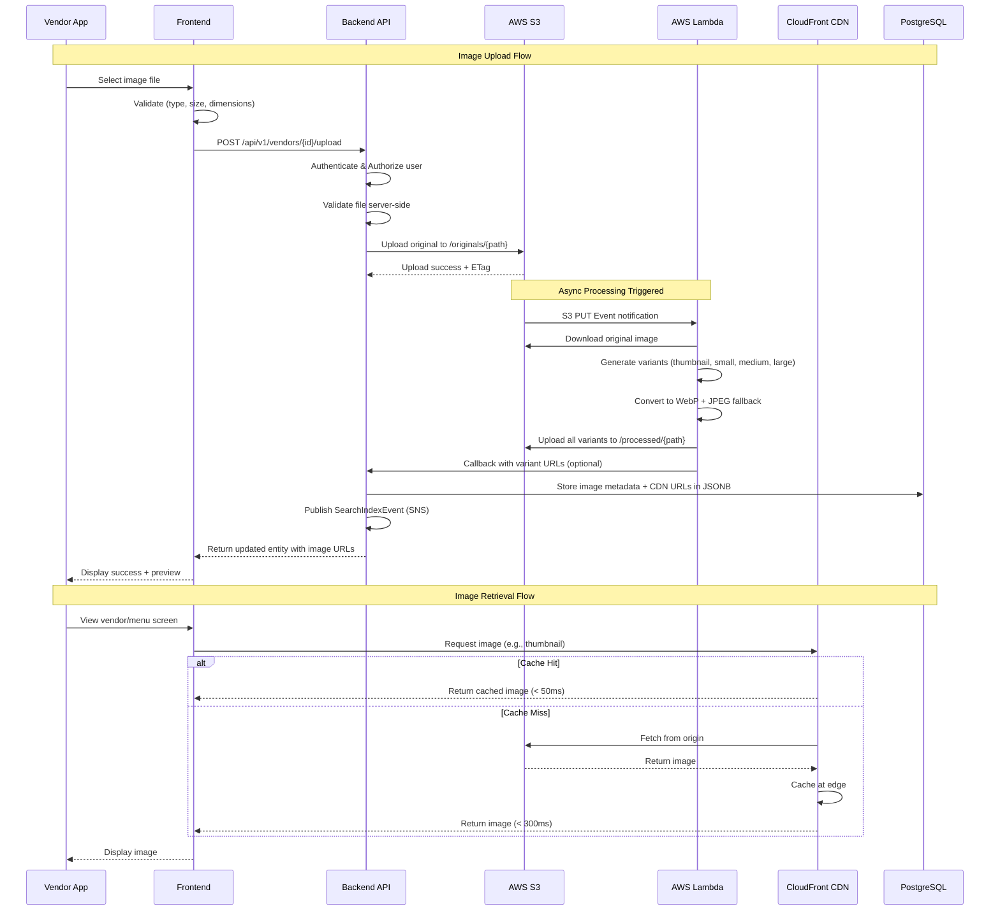
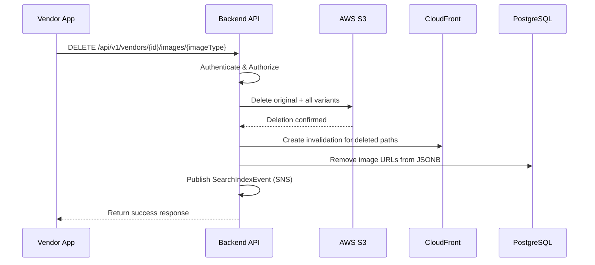

# Image Storage and Rendering Specification

**Document Version:** 1.0  
**Date:** December 10, 2024  
**Status:** Ready for Review  
**Author:** Engineering Team

---

## Table of Contents

1. [Executive Summary](#1-executive-summary)
2. [Storage and Rendering Requirements](#2-storage-and-rendering-requirements)
3. [Responsibility Matrix](#3-responsibility-matrix)
4. [AWS Infrastructure Requirements](#4-aws-infrastructure-requirements)
5. [End-to-End Flow](#5-end-to-end-flow)
6. [S3 Folder Structure](#6-s3-folder-structure)
7. [Implementation Approach](#7-implementation-approach)
8. [Phased Rollout Plan](#8-phased-rollout-plan)

---

## 1. Executive Summary

### Purpose

This document defines the complete specification for storing, processing, and rendering images across the Tea & Snacks Delivery Aggregator platform. It covers vendor logos, branch storefront images, menu item photos, and supporting documents.

### Scope

The specification applies to:
- **Vendor Images:** Company logos, cover photos
- **Branch Images:** Storefront, interior, menu boards, kitchen photos
- **Menu Item Images:** Primary product images, gallery images
- **Documents:** FSSAI certificates, GST documents, trade licenses (stored but not publicly rendered)

### Target Audience

- Backend Engineers
- Frontend/Mobile Engineers
- DevOps/Infrastructure Team
- QA Team

### Key Decisions

| Decision | Choice | Rationale |
|----------|--------|-----------|
| **Storage Provider** | AWS S3 | Cost-effective, highly durable, seamless AWS integration |
| **CDN Provider** | AWS CloudFront | Global edge locations, automatic SSL, S3 integration |
| **Image Processing** | AWS Lambda + Sharp | Serverless, cost-effective, on-demand resizing |
| **Image Format** | WebP (primary), JPEG (fallback) | 25-35% smaller than JPEG, wide browser support |

---

## 2. Storage and Rendering Requirements

### 2.1 Image Types and Specifications

#### Vendor Images

| Image Type | Purpose | Required Sizes | Max Upload Size | Formats Accepted |
|------------|---------|----------------|-----------------|------------------|
| **Logo** | Brand identity, app headers | thumbnail (64px), small (128px), medium (256px) | 2 MB | PNG, JPEG, WebP |
| **Cover Photo** | Vendor profile page banner | thumbnail (200px), small (400px), medium (800px), large (1200px), original | 5 MB | JPEG, WebP |

#### Branch Images

| Image Type | Purpose | Required Sizes | Max Upload Size | Formats Accepted |
|------------|---------|----------------|-----------------|------------------|
| **Storefront** | Branch listing cards | thumbnail (150px), small (300px), medium (600px), large (900px) | 5 MB | JPEG, WebP |
| **Interior** | Branch detail page gallery | small (400px), medium (800px), large (1200px) | 5 MB | JPEG, WebP |
| **Menu Board** | In-store menu display | medium (800px), large (1200px), original | 5 MB | JPEG, WebP |
| **Kitchen** | Hygiene showcase (optional) | small (400px), medium (800px) | 5 MB | JPEG, WebP |

#### Menu Item Images

| Image Type | Purpose | Required Sizes | Max Upload Size | Formats Accepted |
|------------|---------|----------------|-----------------|------------------|
| **Primary** | Main product display | thumbnail (80px), small (160px), medium (320px), large (640px) | 3 MB | JPEG, PNG, WebP |
| **Gallery** | Additional product views | small (200px), medium (400px), large (800px) | 3 MB | JPEG, PNG, WebP |

### 2.2 Image Quality Standards

| Aspect | Requirement |
|--------|-------------|
| **Minimum Resolution** | 400×400 pixels for product images |
| **Aspect Ratio** | 1:1 (square) for logos and menu items; 16:9 for cover/banner images |
| **Color Profile** | sRGB |
| **Compression Quality** | 80% for WebP, 85% for JPEG |
| **Background** | Transparent backgrounds supported for logos (PNG) |

### 2.3 Performance and Caching Goals

| Metric | Target | Measurement |
|--------|--------|-------------|
| **Image Load Time (thumbnail)** | < 100ms | P95 latency from CDN edge |
| **Image Load Time (medium)** | < 300ms | P95 latency from CDN edge |
| **CDN Cache Hit Ratio** | > 95% | CloudFront metrics |
| **Origin Fetch Latency** | < 500ms | S3 + Lambda processing time |
| **Time to First Byte (TTFB)** | < 50ms | CDN edge response |

#### Cache TTL Configuration

| Content Type | CDN Cache TTL | Browser Cache TTL |
|--------------|---------------|-------------------|
| **Original uploads** | 7 days | 1 day |
| **Processed variants** | 30 days | 7 days |
| **Thumbnails** | 30 days | 7 days |

### 2.4 Storage Limits per Entity

| Entity Type | Max Images | Max Total Storage |
|-------------|------------|-------------------|
| **Vendor** | 2 (logo + cover) | 10 MB |
| **Branch** | 10 images + 5 documents | 50 MB |
| **Menu Item** | 1 primary + 4 gallery | 20 MB |

---

## 3. Responsibility Matrix

### 3.1 Frontend Responsibilities

| Responsibility | Description |
|----------------|-------------|
| **Image Selection** | Provide file picker UI with format/size validation |
| **Client-Side Validation** | Validate file type, size, and dimensions before upload |
| **Upload Progress** | Show upload progress indicator to user |
| **Size Selection** | Request appropriate image size based on display context |
| **Lazy Loading** | Implement lazy loading for off-screen images |
| **Progressive Loading** | Show low-res placeholder, then load full image |
| **Error Handling** | Display fallback/placeholder on image load failure |
| **Caching** | Leverage browser cache and respect Cache-Control headers |
| **WebP Fallback** | Detect WebP support; fallback to JPEG if unsupported |

### 3.2 Backend Responsibilities

| Responsibility | Description |
|----------------|-------------|
| **Upload Endpoint** | Accept multipart file uploads via REST API |
| **Authentication** | Validate user authorization for upload operations |
| **File Validation** | Server-side validation of file type, size, content |
| **S3 Upload** | Store original image in S3 with proper metadata |
| **Trigger Processing** | Invoke Lambda for image variant generation |
| **URL Generation** | Generate and store CDN URLs for all image variants |
| **Database Update** | Store image metadata and URLs in JSONB columns |
| **Event Publishing** | Publish events for search index synchronization |
| **Deletion Handling** | Delete all variants when image is removed |

### 3.3 Infrastructure Responsibilities

| Responsibility | Description |
|----------------|-------------|
| **S3 Bucket Management** | Bucket creation, policies, lifecycle rules |
| **CloudFront Distribution** | CDN setup, caching policies, SSL certificates |
| **Lambda Functions** | Image processing function deployment and scaling |
| **IAM Policies** | Access control for S3, Lambda, CloudFront |
| **Monitoring** | CloudWatch alarms, dashboards, cost monitoring |
| **Backup Strategy** | Cross-region replication for disaster recovery |

---

## 4. AWS Infrastructure Requirements

### 4.1 S3 Configuration

#### Bucket Setup

| Bucket | Purpose | Region | Access |
|--------|---------|--------|--------|
| **tea-snacks-media-prod** | Production images | ap-south-1 (Mumbai) | Private (CloudFront OAI) |
| **tea-snacks-media-staging** | Staging/testing | ap-south-1 (Mumbai) | Private (CloudFront OAI) |
| **tea-snacks-documents-prod** | Private documents | ap-south-1 (Mumbai) | Private (Backend only) |

#### Bucket Policies

- **Block Public Access:** Enabled for all buckets
- **Origin Access Identity (OAI):** CloudFront-only access for media buckets
- **CORS Configuration:** Allow uploads from approved domains
- **Versioning:** Enabled for accidental deletion recovery
- **Encryption:** SSE-S3 (Server-Side Encryption)

#### Lifecycle Rules

| Rule | Condition | Action |
|------|-----------|--------|
| **Archive Old Originals** | Original files > 90 days unused | Move to S3 Glacier |
| **Delete Failed Uploads** | Incomplete multipart > 7 days | Delete |
| **Expire Old Versions** | Non-current versions > 30 days | Delete |

### 4.2 CloudFront Configuration

#### Distribution Settings

| Setting | Value |
|---------|-------|
| **Origin** | S3 bucket (via OAI) |
| **Price Class** | Price Class 200 (Asia, Europe, North America) |
| **HTTP/2** | Enabled |
| **HTTP/3 (QUIC)** | Enabled |
| **SSL Certificate** | ACM certificate for cdn.foodapp.com |
| **Minimum TTL** | 86400 seconds (1 day) |
| **Default TTL** | 604800 seconds (7 days) |
| **Maximum TTL** | 2592000 seconds (30 days) |

#### Cache Behaviors

| Path Pattern | Origin | TTL | Compress |
|--------------|--------|-----|----------|
| `/vendors/*` | S3 Media | 7 days | Yes |
| `/branches/*` | S3 Media | 7 days | Yes |
| `/menu-items/*` | S3 Media | 7 days | Yes |

#### Edge Locations (Priority for India)

- Mumbai (Primary)
- Chennai
- New Delhi
- Bangalore
- Hyderabad

### 4.3 Lambda Configuration

#### Image Processing Function

| Setting | Value |
|---------|-------|
| **Runtime** | Node.js 20.x |
| **Memory** | 1536 MB |
| **Timeout** | 30 seconds |
| **Trigger** | S3 PUT event on /originals/* path |
| **Concurrency** | Reserved: 50, Provisioned: 10 |

#### Processing Library

- **Sharp** (Node.js image processing)
- Operations: Resize, format conversion, quality optimization

### 4.4 Cost Estimates (Initial Phase - 3 Cities)

| Service | Estimated Monthly Cost |
|---------|------------------------|
| **S3 Storage (100 GB)** | $2.30 |
| **S3 Requests (1M)** | $0.40 |
| **CloudFront (500 GB transfer)** | $50.00 |
| **Lambda (100K invocations)** | $2.00 |
| **Total Estimated** | ~$55/month |

---

## 5. End-to-End Flow

### 5.1 Image Upload Sequence Diagram



### 5.2 Image Deletion Flow



### 5.3 Image URL Structure

**CDN URL Pattern:**
```
https://cdn.foodapp.com/{entity}/{id}/{imageType}_{size}.{format}
```

**Examples:**
```
https://cdn.foodapp.com/vendors/101/logo_thumbnail.webp
https://cdn.foodapp.com/vendors/101/cover_medium.webp
https://cdn.foodapp.com/branches/205/storefront_small.webp
https://cdn.foodapp.com/menu-items/1501/primary_thumbnail.webp
```

---

## 6. S3 Folder Structure

### 6.1 Directory Hierarchy

```
tea-snacks-media-prod/
├── originals/                          # Original uploaded files (private)
│   ├── vendors/
│   │   └── {vendorId}/
│   │       ├── logo_original.{ext}
│   │       └── cover_original.{ext}
│   ├── branches/
│   │   └── {branchId}/
│   │       ├── storefront_original.{ext}
│   │       ├── interior_original.{ext}
│   │       ├── menu_board_original.{ext}
│   │       └── kitchen_original.{ext}
│   └── menu-items/
│       └── {menuItemId}/
│           ├── primary_original.{ext}
│           └── gallery_{index}_original.{ext}
│
├── processed/                          # Processed variants (served via CDN)
│   ├── vendors/
│   │   └── {vendorId}/
│   │       ├── logo_thumbnail.webp
│   │       ├── logo_small.webp
│   │       ├── logo_medium.webp
│   │       ├── cover_thumbnail.webp
│   │       ├── cover_small.webp
│   │       ├── cover_medium.webp
│   │       └── cover_large.webp
│   ├── branches/
│   │   └── {branchId}/
│   │       ├── storefront_thumbnail.webp
│   │       ├── storefront_small.webp
│   │       ├── storefront_medium.webp
│   │       ├── storefront_large.webp
│   │       └── ... (other image types)
│   └── menu-items/
│       └── {menuItemId}/
│           ├── primary_thumbnail.webp
│           ├── primary_small.webp
│           ├── primary_medium.webp
│           ├── primary_large.webp
│           └── gallery_{index}_{size}.webp
│
└── temp/                               # Temporary upload staging
    └── uploads/
        └── {uploadId}/
            └── pending_file.{ext}

tea-snacks-documents-prod/              # Private documents bucket
└── branches/
    └── {branchId}/
        ├── fssai/
        │   └── certificate_{timestamp}.pdf
        ├── gst/
        │   └── certificate_{timestamp}.pdf
        └── shop_act/
            └── license_{timestamp}.pdf
```

### 6.2 Naming Conventions

| Element | Convention | Example |
|---------|------------|---------|
| **Bucket Name** | `{app}-{type}-{env}` | `tea-snacks-media-prod` |
| **Entity Folder** | `{entity-plural}/{entityId}` | `vendors/101`, `branches/205` |
| **Original File** | `{imageType}_original.{ext}` | `logo_original.png` |
| **Processed File** | `{imageType}_{size}.webp` | `logo_thumbnail.webp` |
| **Gallery Image** | `gallery_{index}_{size}.webp` | `gallery_1_medium.webp` |
| **Document File** | `{docType}_{timestamp}.pdf` | `fssai_20241210.pdf` |

### 6.3 S3 Object Metadata

Each uploaded object includes these metadata headers:

| Metadata Key | Purpose | Example Value |
|--------------|---------|---------------|
| `x-amz-meta-entity-type` | Entity classification | `vendor`, `branch`, `menu-item` |
| `x-amz-meta-entity-id` | Entity identifier | `101` |
| `x-amz-meta-image-type` | Image category | `logo`, `storefront`, `primary` |
| `x-amz-meta-uploaded-by` | User who uploaded | `user-uuid` |
| `x-amz-meta-uploaded-at` | Upload timestamp | `2024-12-10T12:30:00Z` |
| `Content-Type` | MIME type | `image/webp` |
| `Cache-Control` | Caching directive | `public, max-age=2592000` |

---

## 7. Implementation Approach

### 7.1 Database Schema for Images

#### JSONB Structure for `images` Column

**Vendor/Branch:**
```json
{
  "logo": {
    "original": "https://cdn.foodapp.com/vendors/101/logo_original.png",
    "thumbnail": "https://cdn.foodapp.com/vendors/101/logo_thumbnail.webp",
    "small": "https://cdn.foodapp.com/vendors/101/logo_small.webp",
    "medium": "https://cdn.foodapp.com/vendors/101/logo_medium.webp"
  },
  "cover": {
    "original": "https://cdn.foodapp.com/vendors/101/cover_original.jpg",
    "thumbnail": "https://cdn.foodapp.com/vendors/101/cover_thumbnail.webp",
    "small": "https://cdn.foodapp.com/vendors/101/cover_small.webp",
    "medium": "https://cdn.foodapp.com/vendors/101/cover_medium.webp",
    "large": "https://cdn.foodapp.com/vendors/101/cover_large.webp"
  }
}
```

**Menu Item:**
```json
{
  "primary": {
    "thumbnail": "https://cdn.foodapp.com/menu-items/501/primary_thumbnail.webp",
    "small": "https://cdn.foodapp.com/menu-items/501/primary_small.webp",
    "medium": "https://cdn.foodapp.com/menu-items/501/primary_medium.webp",
    "large": "https://cdn.foodapp.com/menu-items/501/primary_large.webp"
  },
  "gallery": [
    {
      "small": "https://cdn.foodapp.com/menu-items/501/gallery_1_small.webp",
      "medium": "https://cdn.foodapp.com/menu-items/501/gallery_1_medium.webp"
    }
  ]
}
```

### 7.2 API Response Format

**Search/Discovery API Response (Image Section):**
```json
{
  "images": {
    "primary": "https://cdn.foodapp.com/vendors/101/cover_thumbnail.webp",
    "cover": {
      "thumbnail": "https://cdn.foodapp.com/vendors/101/cover_thumbnail.webp",
      "small": "https://cdn.foodapp.com/vendors/101/cover_small.webp",
      "medium": "https://cdn.foodapp.com/vendors/101/cover_medium.webp"
    },
    "logo": {
      "small": "https://cdn.foodapp.com/vendors/101/logo_small.webp"
    }
  }
}
```

### 7.3 Frontend Image Loading Strategy

| Display Context | Recommended Size | Approx. File Size |
|-----------------|------------------|-------------------|
| **List/Grid Cards** | `thumbnail` or `small` | 5-15 KB |
| **Detail Page Header** | `medium` | 30-80 KB |
| **Full-Screen Gallery** | `large` | 100-200 KB |
| **App Icon/Avatar** | `thumbnail` | 3-8 KB |

### 7.4 Error Handling

| Error Scenario | Backend Response | Frontend Behavior |
|----------------|------------------|-------------------|
| **File too large** | 400 + "File exceeds maximum size" | Show inline error |
| **Invalid format** | 400 + "Unsupported file format" | Show inline error |
| **Upload timeout** | 408 + "Upload timed out" | Retry with exponential backoff |
| **Processing failed** | 500 + "Image processing failed" | Show retry option |
| **Image not found** | Return null URL | Display placeholder image |

---

## 8. Phased Rollout Plan

### Phase 1: Foundation (Weeks 1-3)
**Target: 3 Initial Cities**

#### Objectives
- Set up AWS infrastructure (S3, CloudFront, Lambda)
- Implement basic upload/download functionality
- Store original images only (no variants initially)

#### Deliverables

| Deliverable | Description | Owner |
|-------------|-------------|-------|
| S3 buckets created | Production and staging buckets | DevOps |
| CloudFront distribution | CDN with basic caching | DevOps |
| Upload API enhancement | Accept multipart uploads, store in S3 | Backend |
| Basic Lambda function | Simple image validation | Backend |
| Frontend upload integration | File picker with validation | Frontend |

#### Success Criteria
- Vendors can upload logo and cover images
- Images served via CloudFront with < 500ms latency
- 99.9% upload success rate

---

### Phase 2: Optimization (Weeks 4-6)
**Target: Production-Ready for 3 Cities**

#### Objectives
- Implement image variant generation
- Add WebP conversion for performance
- Integrate with Search & Discovery APIs

#### Deliverables

| Deliverable | Description | Owner |
|-------------|-------------|-------|
| Lambda image processor | Generate all size variants | Backend |
| WebP conversion | Auto-convert to WebP format | Backend |
| JSONB URL storage | Store variant URLs in database | Backend |
| Search index sync | Update search tables with image URLs | Backend |
| Progressive loading | Low-res placeholder → full image | Frontend |
| Lazy loading | Load images as they enter viewport | Frontend |

#### Success Criteria
- All image variants generated within 10 seconds of upload
- Thumbnails load in < 100ms (P95)
- WebP adoption > 90% of served images
- Search results include images

---

### Phase 3: Scale & Enhance (Weeks 7-10)
**Target: Ready for 10+ Cities Expansion**

#### Objectives
- Optimize for higher traffic
- Add advanced features
- Implement monitoring and alerting

#### Deliverables

| Deliverable | Description | Owner |
|-------------|-------------|-------|
| Edge caching optimization | Tune cache policies for 95%+ hit rate | DevOps |
| Image moderation | Auto-detect inappropriate content | Backend |
| Bulk upload support | Upload multiple menu item images | Backend/Frontend |
| Retry mechanism | Auto-retry failed uploads | Frontend |
| CloudWatch dashboards | Latency, errors, costs monitoring | DevOps |
| Cross-region replication | Disaster recovery setup | DevOps |
| Documentation | Complete API docs for image handling | Backend |

#### Success Criteria
- Support 100K+ images without performance degradation
- CDN cache hit ratio > 95%
- Zero data loss with DR in place
- Complete monitoring coverage

---

### Rollout Timeline Summary

```
Week 1  │ Week 2  │ Week 3  │ Week 4  │ Week 5  │ Week 6  │ Week 7  │ Week 8  │ Week 9  │ Week 10
────────┼─────────┼─────────┼─────────┼─────────┼─────────┼─────────┼─────────┼─────────┼────────
███████████████████│█████████████████████████████│█████████████████████████████████████████
   Phase 1         │        Phase 2              │            Phase 3
   Foundation      │        Optimization         │            Scale & Enhance
                   │                             │
   MVP Launch      │   Production Ready          │    Multi-City Expansion
   (3 Cities)      │   (3 Cities)                │    (10+ Cities)
```

---

## Appendix A: Quick Reference

### Image Size Reference

| Size Name | Max Width | Use Case |
|-----------|-----------|----------|
| `thumbnail` | 80-150px | Grid lists, avatars |
| `small` | 200-400px | List items, cards |
| `medium` | 600-800px | Detail pages, modals |
| `large` | 1200px | Full-screen, galleries |
| `original` | Uploaded size | Admin/backup |

### API Endpoints Summary

| Endpoint | Method | Purpose |
|----------|--------|---------|
| `/api/v1/vendors/{id}/upload` | POST | Upload vendor/branch images |
| `/api/v1/menu-items/{id}/images` | POST | Upload menu item images |
| `/api/v1/vendors/{id}/images/{type}` | DELETE | Delete vendor image |
| `/api/v1/branches/{id}/images/{type}` | DELETE | Delete branch image |

### Environment URLs

| Environment | CDN Domain |
|-------------|------------|
| Production | `cdn.foodapp.com` |
| Staging | `cdn-staging.foodapp.com` |
| Development | `d123abc.cloudfront.net` |

---

**Document Status:** ✅ Ready for Review  
**Next Action:** Review and approve for Phase 1 implementation  
**Questions/Feedback:** Contact Engineering Team Lead
